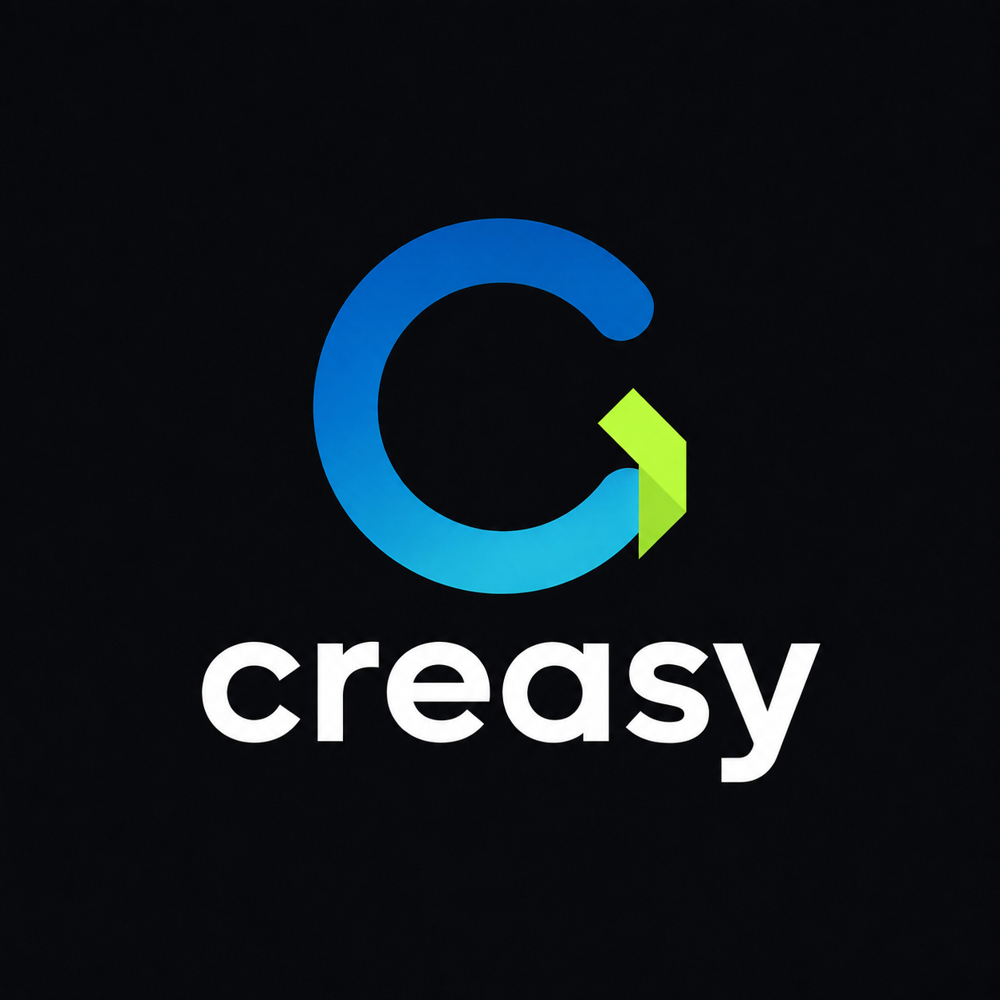
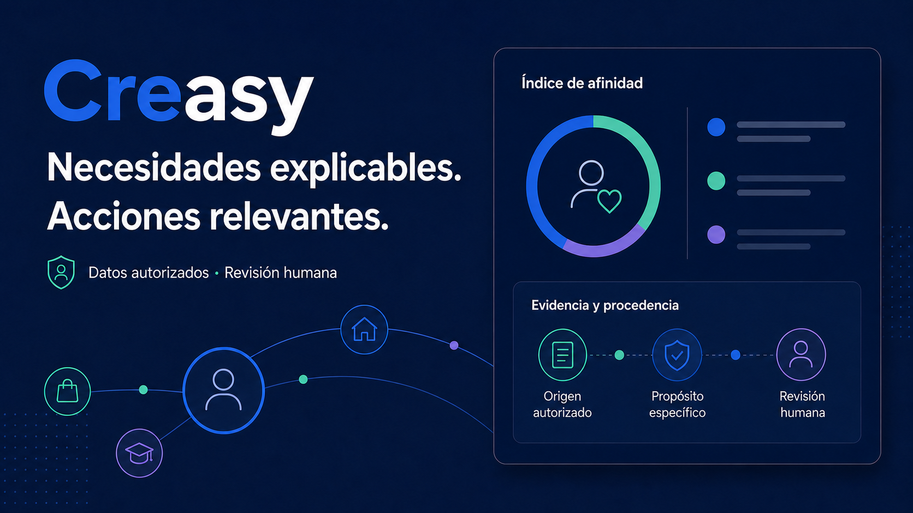
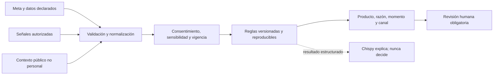

<p align="center">
  
</p>

<h1 align="center">Orientación crediticia explicable</h1>

<p align="center">
  Creasy convierte metas declaradas y señales autorizadas en una orientación relevante,<br />
  trazable y accionable, sin confundir correspondencia con aprobación.
</p>

<p align="center">
  <a href="https://creasy-chi.vercel.app"><strong>Explorar la experiencia →</strong></a>
  ·
  <a href="./docs/DEMO_GUIDE.md">Guía de demostración</a>
  ·
  <a href="./docs/ARCHITECTURE.md">Arquitectura</a>
</p>

<p align="center">
  <a href="https://github.com/Oryzz-COL/Hackathon-30x-Colsubsidio-Credito/actions/workflows/ci.yml">
    
  </a>
  <a href="https://creasy-chi.vercel.app">
    
  </a>
  <a href="./LICENSE">
    
  </a>
  
  
</p>

---

Creasy es un prototipo funcional creado para la Hackathon Colsubsidio × 30X. Integra una experiencia de autogestión para afiliados, un portal de asesoría, un laboratorio de señales y un copiloto con herramientas. Todo el recorrido funciona sin claves externas y utiliza únicamente datos sintéticos.

> [!IMPORTANT]
> Creasy orienta; no aprueba ni rechaza créditos. No consulta centrales de riesgo, no verifica ingresos y no reemplaza el estudio financiero, documental, jurídico ni humano de Colsubsidio.

## Pruébalo en dos minutos

| Experiencia | Enlace | Qué demuestra |
|---|---|---|
| Inicio | [Abrir Creasy](https://creasy-chi.vercel.app) | Propuesta de valor y acceso a los recorridos |
| Afiliado | [Iniciar orientación](https://creasy-chi.vercel.app/orientacion) | Meta, contexto declarado, escenario y solicitud de ayuda |
| Portal asesor | [Abrir portal](https://creasy-chi.vercel.app/demo) | Casos, explicabilidad, auditoría, impacto y Chispy |
| Signal Lab | [Abrir laboratorio](https://creasy-chi.vercel.app/demo?view=enrichment&jury=1) | Procedencia, consentimiento, vigencia y comparación de señales |

La cuenta del portal está precargada:

```text
Correo:     asesor@creasy.demo
Contraseña: creasy2026
```

Recorrido recomendado:

1. Entra en **Orientación**, declara una meta y prueba un monto exigente frente al ingreso.
2. Compara el escenario solicitado con la alternativa que sí podría continuar.
3. Solicita ayuda y revisa el mismo caso en el portal asesor.
4. Abre **Chispy** para consultar razones, faltantes, controles y siguiente acción.

<p align="center">
  
</p>

## El problema

Segmentar solo por edad o categoría de afiliación describe a una persona, pero rara vez explica qué necesita ahora. En el otro extremo, usar señales externas sin control puede introducir vigilancia, sesgos y recomendaciones imposibles de defender.

Creasy propone un punto medio verificable:

| Pregunta | Respuesta de Creasy |
|---|---|
| ¿Qué necesita la persona? | Prioriza su meta declarada y su contexto actual |
| ¿Por qué esta opción? | Muestra las señales admitidas, su procedencia y vigencia |
| ¿Es un buen momento? | Separa el disparador temporal de la correspondencia del producto |
| ¿Cómo continuar? | Respeta canal, horario, frecuencia y consentimiento |
| ¿Qué falta? | Expone datos pendientes y exige revisión humana |

La interfaz no presenta porcentajes absolutos de “afinidad”. Usa niveles cualitativos de correspondencia porque la evidencia sirve para ordenar y explicar opciones, no para prometer certeza.

## Cómo funciona



El motor acepta como máximo una contribución por familia de señales y requiere evidencia independiente antes de orientar. Los faltantes reducen la confianza de la explicación; no se convierten automáticamente en una señal negativa.

### Experiencias conectadas

- **Orientación del afiliado:** traduce una meta en opciones comprensibles, valida un escenario declarado y ofrece una alternativa cuando el planteamiento inicial no se sostiene.
- **Portal asesor:** reúne casos, trazabilidad, comparación, revisión humana, auditoría y acciones de contacto.
- **Signal Lab:** hace visible qué conectores participaron, qué señales fueron excluidas y por qué.
- **Chispy:** consulta herramientas sobre conocimiento, casos, métricas y auditoría; si no existe un proveedor de IA, responde con el motor local.
- **Carga masiva:** procesa CSV/XLSX con mapeo de columnas, límites de tamaño, validación por fila y exportación neutralizada.

## Confianza por diseño

| Principio | Implementación observable |
|---|---|
| Consentimiento antes que personalización | Finalidades separadas para orientación, comportamiento, contacto y simulación financiera |
| Minimización | Solo se usan campos necesarios; documento, correo y teléfono se enmascaran |
| Procedencia | Cada señal conserva fuente, referencia, fecha, naturaleza y estado |
| Sensibilidad bloqueada | Política, religión, salud, biometría, etnia y otras categorías sensibles se excluyen |
| Afinidad ≠ riesgo | Correspondencia, elegibilidad preliminar y capacidad de pago viven en capas distintas |
| Control humano | Ninguna orientación activa una decisión crediticia automática |
| Degradación segura | Sin IA o sin cuota, Chispy conserva una respuesta local útil |
| Datos sintéticos | Una cédula desconocida no inicia búsquedas ni genera información |

Consulta el [modelo técnico de seguridad](./docs/SECURITY.md), la [política de privacidad](./docs/PRIVACY.md) y la [matriz pública de controles](./docs/COMPLIANCE_MATRIX.md).

## Arquitectura y stack

Creasy utiliza una aplicación Next.js con App Router para UI y rutas de servidor. Los contratos están separados por dominio para que conectores, persistencia o proveedores de IA puedan sustituirse sin cambiar las reglas centrales.

| Capa | Tecnología |
|---|---|
| Aplicación | Next.js 16, React 19, TypeScript estricto |
| Interfaz | CSS, Tailwind CSS, Recharts, Lucide |
| Formularios y contratos | React Hook Form, Zod |
| Archivos | Papa Parse, SheetJS |
| Calidad | ESLint, Vitest, Playwright |
| Despliegue | Vercel |
| Persistencia de referencia | Esquema PostgreSQL/Supabase en `db/schema.sql` |

```text
app/          páginas y rutas API
components/   experiencias del afiliado y del asesor
config/       catálogo y configuración de marca
data/         conocimiento y perfiles sintéticos reproducibles
db/           esquema de persistencia de referencia
docs/         arquitectura, privacidad, seguridad y operación
lib/          reglas, conectores, validación, auditoría e integraciones
public/       marca y archivos de ejemplo
tests/        pruebas unitarias y recorridos de navegador
```

La descripción completa está en [docs/ARCHITECTURE.md](./docs/ARCHITECTURE.md).

## Ejecutar localmente

Requisitos:

- Node.js 22.13 o superior; Node.js 24 LTS recomendado.
- pnpm 9 o superior.

```bash
git clone https://github.com/Oryzz-COL/Hackathon-30x-Colsubsidio-Credito.git
cd Hackathon-30x-Colsubsidio-Credito
pnpm install --frozen-lockfile
pnpm dev
```

Abre [http://localhost:3000](http://localhost:3000). El producto funciona completo sin credenciales externas.

### Configuración opcional

Copia `.env.example` a `.env.local` únicamente si quieres probar proveedores externos:

```bash
cp .env.example .env.local
```

| Integración | Variables principales | Sin configurar |
|---|---|---|
| Chispy | `GEMINI_API_KEY` o proveedor compatible | Motor local |
| Correo | `RESEND_API_KEY`, `NOTIFICACIONES_FROM` | Bandeja interna |
| Voz | `ELEVENLABS_API_KEY`, `ELEVENLABS_VOICE_ID` | Respuesta en texto |
| Persistencia | `NEXT_PUBLIC_SUPABASE_URL`, claves de Supabase | Memoria efímera |

Nunca publiques `.env.local` ni uses el prefijo `NEXT_PUBLIC_` para secretos. Todas las variables y límites están documentados en [.env.example](./.env.example).

## Calidad verificable

```bash
pnpm typecheck   # contratos TypeScript
pnpm lint        # reglas estáticas sin warnings
pnpm test        # suite unitaria
pnpm build       # artefacto de producción
pnpm test:e2e    # recorridos críticos en navegador
pnpm audit:prod  # vulnerabilidades de dependencias productivas
```

El workflow de CI ejecuta estas puertas sobre cada pull request y cada cambio en `main`. Las pruebas cubren reglas, catálogo, consentimiento, privacidad, equidad, carga masiva, fallback del copiloto, autenticación, revisión humana y recorridos de extremo a extremo.

## Documentación

| Documento | Propósito |
|---|---|
| [Guía de demostración](./docs/DEMO_GUIDE.md) | Recorrido reproducible y mensajes clave |
| [Arquitectura](./docs/ARCHITECTURE.md) | Límites, componentes y flujo de datos |
| [API](./docs/API.md) | Rutas, contratos y ejemplos |
| [Diccionario de datos](./docs/DATA_DICTIONARY.md) | Campos, procedencia y clasificación |
| [Flujos de usuario](./docs/USER_FLOWS.md) | Experiencias del afiliado y del asesor |
| [Privacidad](./docs/PRIVACY.md) | Finalidades, minimización y derechos modelados |
| [Seguridad técnica](./docs/SECURITY.md) | Controles implementados y brechas para producción |
| [Matriz de controles](./docs/COMPLIANCE_MATRIX.md) | Trazabilidad normativa sin afirmar certificación |
| [Piloto](./docs/PILOT_EXPERIMENT.md) | Hipótesis y medición responsable |
| [Implantación en 90 días](./docs/IMPLEMENTATION_90_DAYS.md) | Camino hacia una operación gobernada |

## Alcance y límites

- Todos los perfiles, eventos, consentimientos y métricas son sintéticos.
- La memoria del servidor es efímera y los casos del recorrido público permanecen en el navegador.
- Las cuentas del portal son locales y existen solo para demostrar el flujo.
- Las tasas y condiciones son una fotografía trazable y deben verificarse contra la fuente oficial vigente.
- `db/schema.sql` es una referencia; no hay una base productiva conectada.
- Un uso con datos reales exige identidad corporativa, autorización por roles, cifrado administrado, monitoreo, revisión jurídica y pruebas de seguridad.

Estas restricciones son parte explícita del diseño. Creasy demuestra una orientación responsable; no presenta un prototipo como si fuera un sistema crediticio productivo.

## Seguridad y contribuciones

- Reporta vulnerabilidades de forma privada siguiendo [SECURITY.md](./SECURITY.md).
- Consulta [CONTRIBUTING.md](./CONTRIBUTING.md) antes de proponer cambios.
- La participación se rige por [CODE_OF_CONDUCT.md](./CODE_OF_CONDUCT.md).

## Equipo

Creasy fue construido por Oryzz:

- Juan David Morales Galindo
- Juan Camilo Salazar Lara
- Felipe Condia

## Licencia

Distribuido bajo la [Licencia MIT](./LICENSE). Copyright © 2026 Oryzz y las personas autoras.
